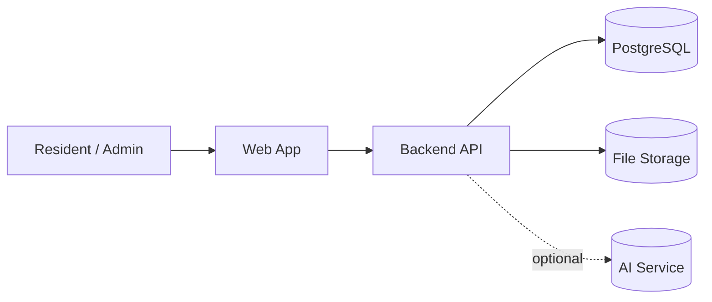

# System Context

## 🇸🇰 SK

### Účel systému
BDM (Building / Bytový Dom Management) je aplikácia určená
na správu komunikácie a procesov v bytových domoch.

Systém pokrýva:
- oznamy a nástenku
- nahlasovanie a riešenie porúch (tikety)
- hlasovania a rozhodovanie
- komunikáciu medzi obyvateľmi (komentáre, reakcie)
- voliteľnú AI pomoc (iba návrhy, nikdy automatické rozhodnutia)

Základné princípy:
- web ako primárna platforma, mobil neskôr
- oddelený frontend a backend
- multi-tenant architektúra od začiatku

---

## 🇬🇧 EN

### System purpose
BDM (Building Management) is an application designed
to manage communication and operational processes
within apartment buildings.

The system covers:
- notices and announcements
- issue reporting and workflows (tickets)
- voting and decision-making
- communication between residents (comments, reactions)
- optional AI assistance (suggestions only, never automatic decisions)

Core principles:
- web-first, mobile later
- separated frontend and backend
- multi-tenant architecture from day one

---

## System overview

