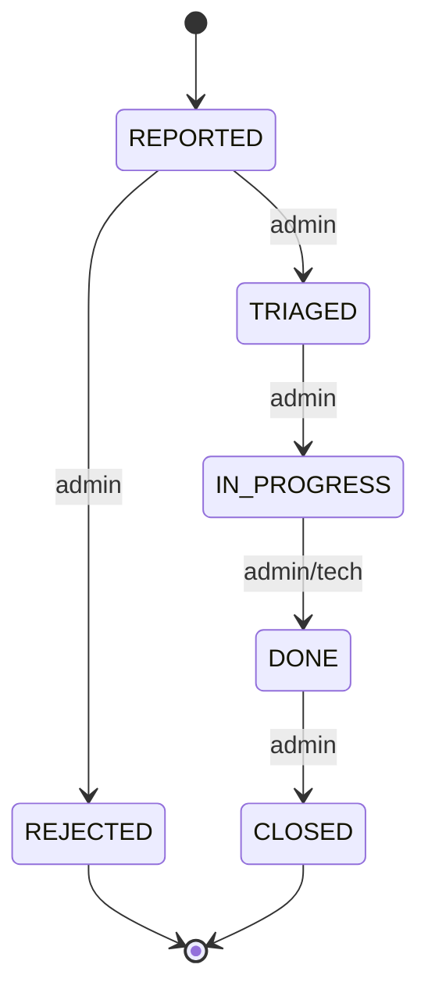

# Ticket workflow (MVP)

## 🇸🇰 SK

### Stavový model tiketu
Tikety slúžia na nahlasovanie a riešenie porúch v bytovom dome.
Každý tiket prechádza jasne definovaným životným cyklom.

Stavy:
- REPORTED – porucha nahlásená obyvateľom
- TRIAGED – porucha overená správcom
- IN_PROGRESS – porucha sa rieši
- DONE – riešenie dokončené
- CLOSED – tiket uzavretý
- REJECTED – tiket zamietnutý

Prechody:
| From | To | Kto | Poznámka |
|---|---|---|---|
| REPORTED | TRIAGED | ADMIN | overenie tiketu |
| TRIAGED | IN_PROGRESS | ADMIN | začatie riešenia |
| IN_PROGRESS | DONE | ADMIN / TECH | riešenie hotové |
| DONE | CLOSED | ADMIN | finálne uzavretie |
| REPORTED | REJECTED | ADMIN | povinný dôvod |

Každá zmena stavu musí byť auditovaná.

---

## 🇬🇧 EN

### Ticket lifecycle
Tickets are used to report and resolve issues within a building.
Each ticket follows a strictly defined lifecycle.

States:
- REPORTED – issue reported by resident
- TRIAGED – issue validated by admin
- IN_PROGRESS – issue is being resolved
- DONE – resolution completed
- CLOSED – ticket closed
- REJECTED – ticket rejected

Transitions:
| From | To | Who | Notes |
|---|---|---|---|
| REPORTED | TRIAGED | ADMIN | validate ticket |
| TRIAGED | IN_PROGRESS | ADMIN | work started |
| IN_PROGRESS | DONE | ADMIN / TECH | fix completed |
| DONE | CLOSED | ADMIN | final closure |
| REPORTED | REJECTED | ADMIN | reason required |

All state transitions must be audited.
