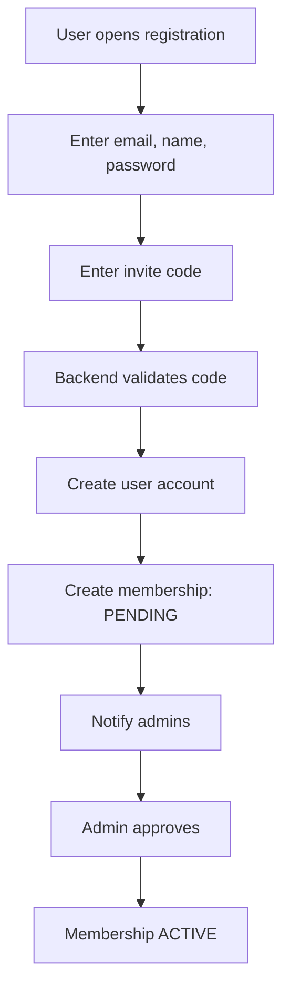

# Registration & Onboarding (MVP)

## 🇸🇰 SK

### Cieľ registrácie
Registrácia slúži na bezpečné priradenie susedov
k správnej bytovej jednotke v rámci bytového domu.

Systém je navrhnutý tak, aby:
- zabránil registrácii cudzích osôb
- zachoval kontrolu správcu nad prístupmi
- umožnil jednoduchý onboarding susedov

---

### Základné princípy
- registrácia je viazaná na **pozvánku (invite code)**
- používateľ sa nemôže sám stať ADMIN
- prístup k dátam je možný až po schválení
- každá registrácia je auditovateľná

---

### Vstupy pri registrácii
Používateľ zadáva:
- email
- meno
- priezvisko
- heslo
- pozývací kód bytovej jednotky
- požadovanú rolu (default: RESIDENT)

---

### Stav členstva (membership)
- PENDING – čaká na schválenie správcom
- ACTIVE – schválené, plný prístup
- REJECTED – zamietnuté

---

### Registračný flow

---

### Bezpečnostné pravidlá
- bez invite code nevznikne membership
- bez ACTIVE membership používateľ nevidí tenant dáta
- ADMIN rola sa prideľuje výhradne manuálne
- jeden invite code môže mať obmedzený počet použití

---

## 🇬🇧 EN

### Registration purpose
Registration ensures secure assignment of residents
to the correct apartment unit within a building.

The system is designed to:
- prevent unauthorized registrations
- keep administrator control over access
- allow simple resident onboarding

---

### Core principles
- registration is based on an invite code
- users cannot self-assign ADMIN role
- data access is allowed only after approval
- all registrations are auditable

---

### Registration inputs
The user provides:
- email
- first name
- last name
- password
- unit invite code
- requested role (default: RESIDENT)

---

### Membership status
- PENDING – awaiting admin approval
- ACTIVE – approved, full access
- REJECTED – denied

---

### Security rules
- no membership without invite code
- no tenant data access without ACTIVE membership
- ADMIN role is assigned manually only
